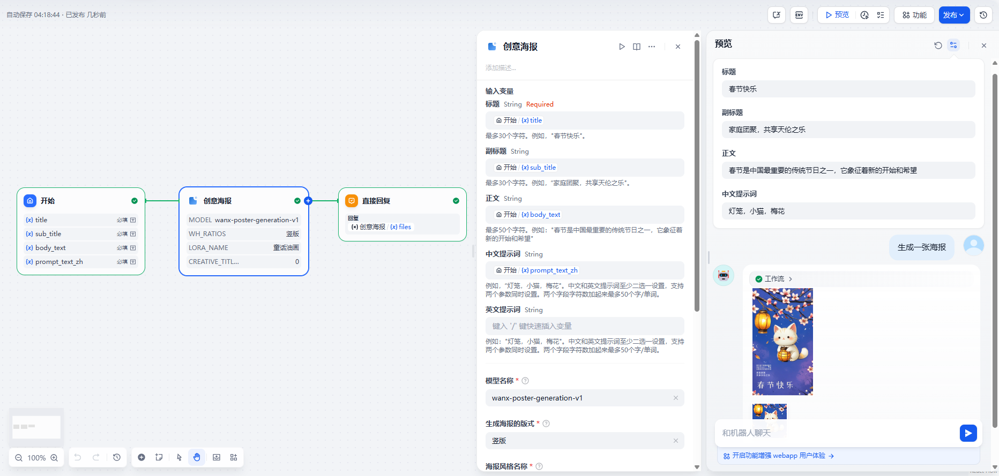

# ImageTool

> A powerful Dify plugin for generating stunning images from text prompts, refining hand‑drawn sketches, and generating creative posters using the Tonyi API.

---

## 📖 Overview

`ImageTool` allows you to seamlessly integrate image generation into your Dify workflows. With just a few simple steps, you can:

- **Generate detailed images from text prompts**
- **Transform rough sketches (doodles) into polished artwork**
- **Generate creative posters from titles, subtitles, body text, and prompts**

Powered by the Tonyi API, this plugin brings AI‑driven creativity directly into your Dify projects.

---

## ⚙️ Configuration

1. **Obtain a Tonyi API Key**
   - Visit the [AliCloud Bailian Console](https://bailian.console.aliyun.com/?apiKey=1#/api-key) and apply for an API key.
2. **Install the ImageTool Plugin**
   - In Dify, open the **Plugins Marketplace**.
   - Search for **"ImageTool"** and click **Install**.
3. **Authorize in Dify**
   - Navigate to **Tools > ImageTool > Authorize** in the Dify sidebar.
   - Enter your Tonyi API key and click **Save**.

---

## 🚀 Usage

Once authorized, you can use the following core features:

### 1. Text to Image

Enter a descriptive text prompt and let the Tonyi API render it into a high‑quality image.

> **Tip:** Be as specific as possible with colors, styles, and composition to guide the AI.

### 2. Doodle to Image

Upload a simple sketch or draw one directly in Dify. ImageTool will use the Tonyi API to refine hand‑drawn sketches into polished artwork.

#### Example Input Sketch

#### Generated Illustration

### 3. Creative Poster

Generate creative posters from titles, subtitles, body text, and prompts. This feature is ideal for designing brand promotional posters, event flyers, and social media covers using pre-defined or custom poster templates.

---

## 🤝 Contributing & Support

Have a feature request or found a bug? We welcome your feedback!

- **Submit an issue**: [GitHub Issues](https://github.com/caffbyte/dify-plugin-imagetool/issues)
- **Pull Requests**: Feel free to fork the repo, make changes, and submit a PR.
