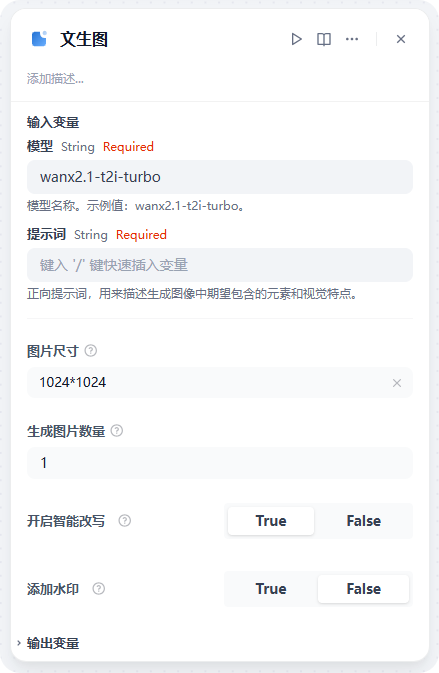

## dify-plugin-imagetool

### Overview

Generates images based on text prompts using the Tonyi API.

### Setup

1. **Apply for a Tonyi API Key**  
   Visit the [AliCloud Bailian Console](https://bailian.console.aliyun.com/?apiKey=1#/api-key) to apply for an API key.

2. **Install ImageTool from the Plugin Marketplace**  
   Search for “ImageTool” in the Plugin Marketplace and install it.

3. **Configure in Dify**  
   In the Dify navigation panel, go to **Tools > ImageTool > Authorize**, and enter your API key.

4. **Start Using the Tool**  
   Once configured, you can start generating images via text prompts.

   

---

**Feature Requests and Issues**  
Submit feature requests or report issues via [GitHub Issues](https://github.com/caffbyte/dify-plugin-imagetool/issues).
